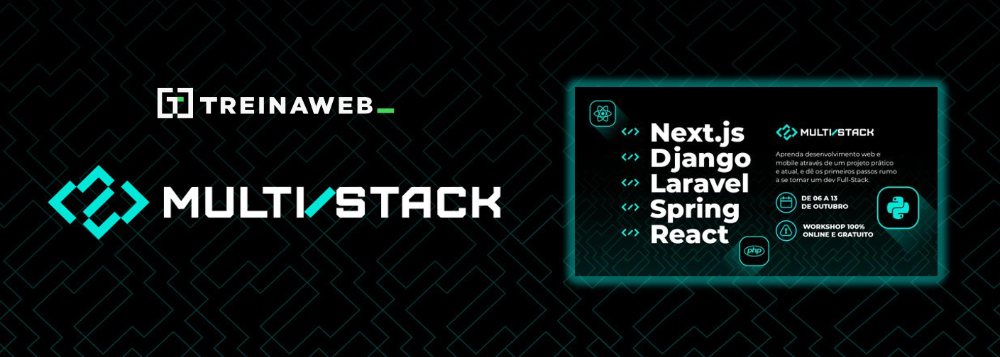

# 🖥 Semana Multi Stack TreinaWeb

  
  
  
  Workshop da TreinaWeb de 6 a 13 de outubro de 2021.
  

## 🚀 Tecnologias

 
  

## 📚 Assets 

[Material complementar](https://treinaweb.notion.site/Multi-stack-02-3b8d2d382ba44d41a23f661aeb15b0ac)

### Front-End:  React + Next.js

\- [Checklist](https://treinaweb.notion.site/Semana-Multi-Stack-Front-End-02448c456ce6440aa49d54c190938b98)\
\- [Repositório de referência](https://github.com/treinaweb/treinaweb-workshop-multistack-react)

### Back-End:  Python + Django

\- [Checklist](https://treinaweb.notion.site/Semana-Multi-Stack-Django-831febc8cda7430bbbe0481117def5ab)\
\- [Repositório de referência](https://github.com/treinaweb/treinaweb-workshop-multistack-python)

### Mobile:  React Native + Expo

\- [Checklist](https://treinaweb.notion.site/Semana-Multi-Stack-Mobile-c6ec8daaadb942a3add19eb104a1dccc)\
\- [Repositório de referência](https://github.com/treinaweb/treinaweb-workshop-multistack-react-native)

## 🕓 Carga Horária

- ✔️ Aula 1 (1h54) (Front-End)
- ✔️ Aula 2 (2h03) (Front-End)
- ✔️ Aula 3 (1h43) (Back-End)
- ✔️ Aula 4 (1h28) (Back-End)
- ❌ Aula 5 (1h46) (Mobile)
